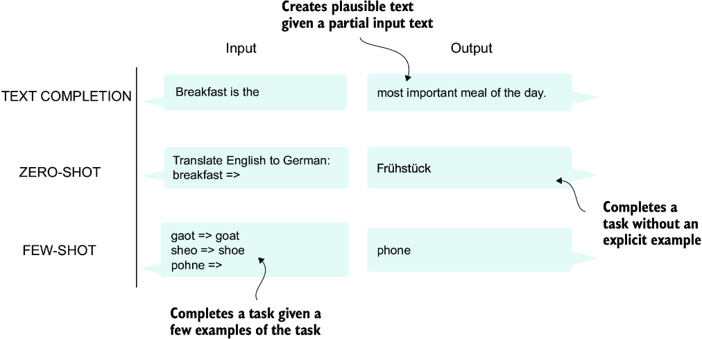
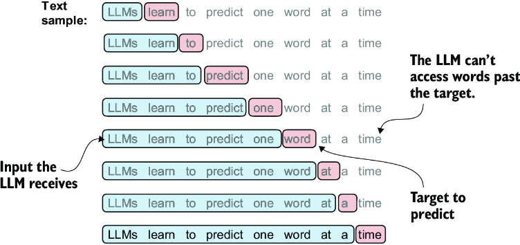

# Building LLMs from scratch

## Chapter 1 - What is LLM

- LLMs utilize an architecture called the transformer, which allows them to pay selective attention to different parts of the input when making predictions, making them especially adept at handling the nuances and complexities of human language.
- few-shot capabilities means a model can learn to perform new tasks based on only a few examples instead of needing extensive training data.
- there are two stages of training
  - pretraining: here the model is trained over large unlabelled text. this model is called the foundation model and can be used to complete a sentence for example
  - fine tuning: here the model is trained on a labelled data. Fine tuning is further divided into two types:
  - instruction fine tuning: e.g. providing instructions and answers (e.g. a translation from one language to the other)
  - classification fine tuning: e.g. email classification like spam, promotion, etc.

### Transformer architecture


- Encoder embeds, i.e. encodes the input in a numerical form (e.g. one hot encoding)
- Decoder consumes this encoded vector to produce the output. The figure here is showing that the decoder has already translated the sentence up to the last word and then all the previously translated words are being used to spit out the last word "Biespiel"
- A key component of transformers and LLMs is the self-attention mechanism (not shown), which allows the model to weigh the importance of different words or tokens in a sequence relative to each other. This mechanism enables the model to capture long-range dependencies and contextual relationships within the input data, enhancing its ability to generate coherent and contextually relevant output.

### GPT vs BERT

- BERT (bidirectional encoder representations from transformers) and the various GPT models (short for generative pretrained transformers), built on this concept to adapt this architecture for different tasks
- GPT is designed for generative tasks, BERT and its variants specialize in masked word prediction


#### n-shot learning




### GPT architecture

- GPT architecture is simplified version of the transformer architecture in the sense that it has only the decoder part. But it also is much bigger. e.g.  original transformer repeated the encoder and decoder blocks six times. GPT-3 has 96 transformer layers and 175 billion parameters in total. 
- GPT is remarkable because it essentially runs unsupervised on unlabelled data because it uses it's own generated prvious data to predict the next data


### Training an LLM


## Chapter 2 - Working with text data

### Embedding

- The concept of converting data into a vector format is often referred to as embedding. Embedding is a mapping from discrete objects, such as words, images, or even entire documents, to points in a continuous vector space
- different data types (text, audio, video) require different embeddings. Infact, even for text, there are different types of embedding. e.g. word, sentence, or paragraph level
- embedding is also done with the help of an embedding model (neural network)
- Word2Vec is one popular example of embedding model.  With Word2Vec words that appear in similar contexts tend to have similar meanings. Consequently, when projected into two-dimensional word embeddings for visualization purposes, similar terms are clustered together (e.g. eagle, duck, goose will be in one group, car, bike, truck will be clustered in another group, etc.)
- Word embeddings can have varying dimensions ranging from 1 to thousands

#### Tokenization

##### Basic encoding

Steps:

1. parse the text and do the cleanup as required (e.g. remove white spaces, separate out punctuations from the words. (e.g. "Is this a question? -- asked Renee" --> ['is', 'this', 'a', 'question', '?'. --', 'asked', 'Renee'])
2. Convert the tokens to integers (token-ids). This is done by using a lookup which maps words to a corresponding integer value. Let's say we wanted to assign token ids to all words in a book. We'd parse all words, numbers, punctuations, etc. from a book and arrange them in alphabetical order while removing duplicates. Then we'd assign integer ids to these words in the alphabetical order. This is our dictionary. Then for any given sentence, we just lookup this dictionary.
3. Enhance the tokenizer to account for unknown words and mark boundaries between separate things (e.g. paragraphs, different documents, etc.) See below:


There are other variants of these special meaning tokens, like BOS, EOS (beginning and end of sequence), PAD (if it's required that all text is the same size when training in batches, shorted text can be padded with paddning tokens)

##### Byte pair encoding (BPE)

- Byte pair encoding allows for not only encoding unknown words but also retrieving them as-is. As opposed to the previous approach where the tokenizer always encoded the unknown words with the same tag. So, when decoding, there is no way to differential between different unknown words
- BPE does this by breaking down the unknown words into known words, as much as possible or even at the letter level if possible. e.g. if the word to be encoded was 'someUknownWord' it will be broken down into 'some', 'unknown' and 'word', all three of which are well known. One example is shown below:


#### Data sampling with a sliding window

- The next step after encoding the tokens in the numerical values is to generate input target pairs
- In this step, we need to prepare the input data and the expected output that LLM is supposed to produce. This is where the sliding window approach comes into picture. See example below:



- Assuming we select the context size = 4, i.e. the MAX number of tokens included in the input, sample training input (`x`) and the target (`y`) will look like so:

```text
x: [290, 4920, 2241, 287]
y:      [4920, 2241, 287, 257]
```

Here, `y` is `x` shifted by 1. And we use it for training as follows:

- we provide x values up to `n-1` and provide the target at `n`. When we put this in a loop, training data will look like this:

```text
x ----> y
[290] ----> 4920
[290, 4920] ----> 2241
[290, 4920, 2241] ----> 287
[290, 4920, 2241, 287] ----> 257
```

In real world, this could look something like this:

```text
and ---->  established
 and established ---->  himself
 and established himself ---->  in
 and established himself in ---->  a
```

Notice that the number of input tokens increment up to the predetermined context size (4) and the next expected `y` is provided. That means, it is important to keep at least some context in order to predict the correct `y` so the sentence can be coherent. A significant amount of tuning effort is probably required to determine an optimal context size.

#### Conversion to tensor datasets and generating batches

- Once the training and target tokens are prepared, they can be represented as pytorch tensors like this:


Notice here that the length of the row is 4 because that's the context window size we selected. In reality, this size is at least 256.
Also, the words are shown in the image instead of the actual tokens for clarity.


- The pytorch tensors are actually underlying datatypes for the pythorch datasets, which are the `Dataset` type classes. The whole purpose of these classes is to provide efficient iteration (by implementing dunder methods). Example code:
  
 ```python
import torch
from torch.utils.data import Dataset, DataLoader
class GPTDatasetV1(Dataset):
    def __init__(self, txt, tokenizer, max_length, stride):
        self.input_ids = []
        self.target_ids = []

        token_ids = tokenizer.encode(txt)    #1

        for i in range(0, len(token_ids) - max_length, stride):     #2
            input_chunk = token_ids[i:i + max_length]
            target_chunk = token_ids[i + 1: i + max_length + 1]
            self.input_ids.append(torch.tensor(input_chunk))
            self.target_ids.append(torch.tensor(target_chunk))

    def __len__(self):    #3
        return len(self.input_ids)

    def __getitem__(self, idx):         #4
        return self.input_ids[idx], self.target_ids[idx]
  ```

  - The `stride` param has to do with batching. Batches are the chunks of data with which the networks are trained. 
  
  


## Chapter 3 Coding Attention Mechanism
  
Three main stages of coding an LLM


Levels of self-attention


### 3.1 Problem with modeling long sequences

Consider the example of translating a long sentence where word to word translation will result in a wrong result


This is why we need the encoder module to read and process the entire sequence and decoder to translate

Before the advent of the transformer models, the RNNs (recurrent neural networks) were a popular choice for tasks like translation. Without going into much details, it suffices to know that in RNNs, the encoder part processes the entire input text into a hidden state. The decoder then takes in this hidden state to produce the output. 

Think of this as a deep neural network divided into input and output layers. When the output layer starts doing its thing, it does so, only based on the connections with the layer it is connected to. That is, it does not have access to the earlier layers.
Now imagine that a long sentence needs to be translated and your DNN can only accept 5 words as inputs at a time. That means, the last layer of the the encoding part will only have the context worth 5 words and therefore the decoder will also have the context worth 5 words only - which may not be enough for the decoder to generate the accurate next word in the translation.
The big limitation of encoder–decoder RNNs is that the RNN can’t directly access earlier hidden states from the encoder during the decoding phase. Consequently, it relies solely on the current hidden state, which encapsulates all relevant information. This can lead to a loss of context, especially in complex sentences where dependencies might span long distances.

To solve this problem for RNN, Bahdanau attention mechanism  was proposed that allowed the decoder layer to have access to all input tokens. The "attention" part here is that, the input tokens are also assigned weights by the encoder layers according to their importance.

Although, very soon after the Bahdanau attention mechanism was introduced, reserchers figured out that the RNNs are not necessary for natural language processing at all. And proposed the original transformer architecture discussed in chapter 1.

### Self attention

Self-attention is a mechanism that allows each position in the input sequence to consider the relevancy of, or “attend to”, all other positions in the same sequence when computing the representation of a sequence. Let's break this down:

- The goal is to calculate the representation of the entire sequence - not just one position. We do this by considering the relevancy of all other positions with respect to a given position
- **when computing the representation of a sequence**: That means the goal is to compute representation of a sequence. This sequence is the embedding vector
- **mechanism that allows each position in the input sequence to consider the relevancy of, or “attend to”, all other positions in the same sequence**: means we have an input sequence and we want to consider the relevancy to all other positions when we calculate the representation of a given position. e.g. in the sentence Roses are red, if we were to represent 'red', we could just represent it as a single word or we could represent it by also considering the sequence "roses are" that follows before the word "red"

**Self-attention** vs **attention**

- self refers to the attention within the same sequence (e.g. pixels within a picture, words in a given sentence). The mechanism computes the "attention weights" by relating different positions within a single input sequence. It assesses and learns the relationships and dependencies between various parts of the input itself, such as words in a sentence or pixels in an image.
- in traditional attention mechanisms, the focus is on the relationships between elements of two different sequences, such as in sequence-to-sequence models where the attention might be between an input sequence and an output sequence

### Simple self-attention mechanism without trainable weights


The goal of self-attention is to compute a context vector for each input element that combines information from all other input elements. In this example, we compute the context vector z(2). The importance or contribution of each input element for computing z(2) is determined by the attention weights a21 to a2T. When computing z(2), the attention weights are calculated with respect to input element x(2) and all other inputs.

To illustrate this concept, let’s focus on the embedding vector of the second input element, x(2) (which corresponds to the token "journey"), and the corresponding context vector, z(2), shown at the bottom of figure 3.7. This enhanced context vector, z(2), is an embedding that contains information about x(2) and all other input elements, x(1) to x(T).


In the screenshot above, we are using the word "journey" as a reference token. To calculate the attention score for all other tokens in the sentence, we simply take a dot product of the embedding vector for "journey" with embedding vectors of other words. 
e.g. the dot product of `journey` with `Your` would be `[0.55,0.87,0.66] dot [0.43,0.15,0.89] ~= 0.9`. Note that these weights are shown with less precision in the diagram to save space, therefore the descrepency. Actual numbers are:
```
inputs = torch.tensor(
  [[0.43, 0.15, 0.89], # Your     (x^1)
   [0.55, 0.87, 0.66], # journey  (x^2)
   [0.57, 0.85, 0.64], # starts   (x^3)
   [0.22, 0.58, 0.33], # with     (x^4)
   [0.77, 0.25, 0.10], # one      (x^5)
   [0.05, 0.80, 0.55]] # step     (x^6)
)
```

**Why dot product**
- dot product is a measure of similarity because it quantifies how closely two vectors are aligned. (remember, dot product is the sum of a products of elements at the same index. Therefore, the dot product will be higher if the same index elements are higher)

For the concerned input "journey", the attention scores look like this:

```
tensor([0.9544, 1.4950, 1.4754, 0.8434, 0.7070, 1.0865])
```

**Normalize attention weights**

We then normalize the attention weights:


In practise, it's better to use the softmax function for normaization to achieve managing extreme values and more favorable gradient properties during training. Even naive softmax may encounter numerical instability problems, such as overflow and underflow, when dealing with large or small input values. Therefore, in practice, it’s advisable to use the PyTorch implementation of softmax, which has been extensively optimized for performance.

For the concerned input  "journey" the normalized attention weights look like this:

```
Attention weights: tensor([0.1385, 0.2379, 0.2333, 0.1240, 0.1082, 0.1581])
Sum: tensor(1.)
```

**Calculate Context Vector**

Finally, the context vector is calculated as follows:


Here, we're multiplying the input cells with attention weights and finally adding each column to the final context vector. So considering the inputs tensor, the math would look like this:
```
inputs = torch.tensor(
  [[0.43, 0.15, 0.89], * 0.1    = [0.043, 0.015, 0.089]
   [0.55, 0.87, 0.66], * 0.2    = [0.11, 0.174, 0.132]
   [0.57, 0.85, 0.64], * 0.2    = [0.114, 0.170, 0.128]
   [0.22, 0.58, 0.33], * ...    = [...]
   [0.77, 0.25, 0.10], * ...    = [...]
   [0.05, 0.80, 0.55]] * 0.1    = [0.005, 0.080, 0.055]
)
total                           = [0.4419, 0.6515, 0.5683]
 
```

Note once again that this is the context vector for input1 i.e. the word "journey". When we calculate this for all the words in the context window, we will get a context vector for each word like so:

```
tensor([[0.4421, 0.5931, 0.5790], # context vector for "your"
        [0.4419, 0.6515, 0.5683], # context vector for "journey"
        [0.4431, 0.6496, 0.5671], # context vector for "starts"
        [0.4304, 0.6298, 0.5510], # context vector for "with"
        [0.4671, 0.5910, 0.5266], # context vector for "one"
        [0.4177, 0.6503, 0.5645]]) # context vector for "step"
```


**Intuition summary of what we did above**

1. We started with the embedding vectors for all the words in our context window. Keep in mind that these embedding vectors are not random numbers but representation of the words themselves. Therefore, "similar" words (by some measure), will have similar looking vectors. e.g. `journey = [0.55, 0.87, 0.66] and starts = [0.57, 0.85, 0.64]` have very similar embedding vectors because they are probably seen in the training set together very often
2. Then we used these embedding vectors to calculate a "similarity coefficient" by calculating the dot product of embedding vectors - we call these "attention scores". Again, if you look at the normalized attention scores (`([0.1385, 0.2379, 0.2333, 0.1240, 0.1082, 0.1581])` for "journey"), you can see that the attention score from journey->journey and journey->starts is almost identical (0.2379 vs 0.2333)
3. Now that we have calculated how much relevance a given word is to other words close to it, we use that information to calculate a weigthed sum. This sum is like a modification of the word's vector embedding. The modification accounts for the word's context. e.g. the word journey had an embedding vector = `[0.55, 0.87, 0.66]` before accounting for the context. Now we accounted for the context and the new embedding vector is `[0.4419, 0.6515, 0.5683]`. Think about this for a second - if a word in question is surrounded by very dissimilar words, the attention weights assigned to them would be small and as a result, the context vector would have a smaller magnitude. Therefore, it becomes an unimportant word. Conversely, if a word is surrounded by similar words, the magnitude of the context vector would be large and therefore the word becomes important.

### Implementing self-attention with trainable weights

In the last step above, we calculated the *simplified* context vector by simply adding the attention weights. The actual self attention mechanism takes this a step further and calculates the self attention weights as the weigthed sum over the input vectors specific to a given input vector. 